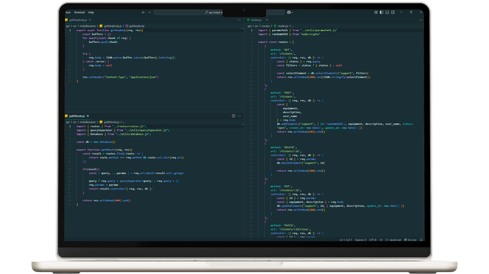

# Delivery API



**Delivery API** é uma aplicação desenvolvida em TypeScript que utiliza o Prisma para gerenciamento de banco de dados. Esta API foi projetada para gerenciar operações relacionadas a entregas, fornecendo endpoints para criação, atualização, exclusão e consulta de dados pertinentes.

## Funcionalidades

- **Gerenciamento de Entregas:** Criação, atualização e exclusão de registros de entregas.
- **Autenticação e Autorização:** Implementação de mecanismos de autenticação para segurança das operações.
- **Integração com Banco de Dados:** Utilização do Prisma para interações eficientes com o banco de dados.

## Tecnologias Utilizadas

- **TypeScript:** Linguagem principal para o desenvolvimento da aplicação.
- **Prisma:** ORM para gerenciamento de banco de dados.
- **Docker:** Utilizado para containerização da aplicação, facilitando a implantação e escalabilidade.
- **Jest:** Framework de testes para garantir a qualidade do código.

## Estrutura do Projeto

- **prisma/**: Contém os esquemas do Prisma e as migrações do banco de dados.
- **src/**: Diretório principal do código-fonte da aplicação.
  - **controllers/**: Controladores que gerenciam as requisições e respostas.
  - **services/**: Serviços que contêm a lógica de negócios.
  - **routes/**: Definição das rotas da API.
  - **middlewares/**: Middlewares para autenticação, validação, etc.
  - **utils/**: Funções utilitárias e helpers.

## Configuração e Execução

1. **Clonar o Repositório:**
   ```bash
   git clone https://github.com/zielisgabriel/delivery-api.git
   cd delivery-api
   ```

2. **Instalar as Dependências:**
   ```bash
   npm install
   ```

3. **Configurar as Variáveis de Ambiente:**
   - Renomeie o arquivo `.env-example` para `.env`.
   - Configure as variáveis de ambiente conforme necessário.

4. **Executar as Migrações do Banco de Dados:**
   ```bash
   npx prisma migrate dev
   ```

5. **Iniciar a Aplicação:**
   ```bash
   npm run dev
   ```

## Testes

Para executar os testes, utilize o comando:

```bash
npm test
```